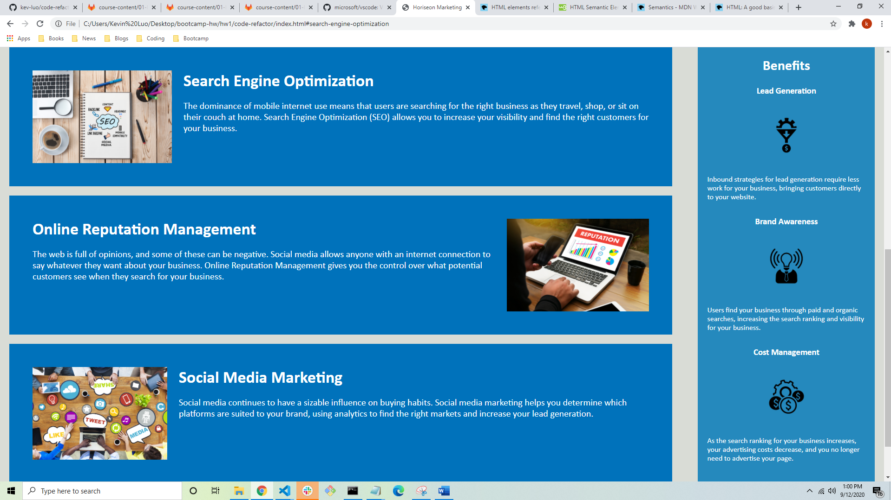

# Code-Refactor: Clean-Up Time

## Description
Code refactoring is the process of editing and cleaning up previously written code
without changing the intended function of the code itself. The purpose of refactoring is
to make subsequent maintenence of the code more efficient - this is done by making the code more readable (adding cohesiveness to the overall code structure) and by checking that all interactive elements, such as links, as operating as anticipated. Expanding on the readability of the code, several CSS selectors and properties were consolidated to make the stylesheet more concise, and the CSS code structure was altered to match the semantic structure of the HTML elements. 

An additional aim of refactoring is to make the code more accessible to those with disabilities and/or socio-economic limitations. This is achieved by adding alt attributes to all images, describing the content of the image, adding comment descriptions before each HTML element, and using semantic HTML tags. The use of semantic HTML tags over non-semantic HTML tags is also beneficial for search engine optimization. 

## Table of Contents

* Process
* Usage
* Credits
* License

## Process

I began by taking a look at the website itself to visualize the site layout and test out the interactive elements. The webiste consisted of a navigation bar positioned horizontally at the top, followed by a background image underneath it which filled the top half of the main site. The lower half of the site consisted of three main sections describing the services provided by Horiseon, along with a side-bar to the right of these sections that outlined the benefits derived from Horiseon's services.

Once I got a better understanding of how the site was laid out, I took a look at the HTML and CSS code. Going through the HTML code, I focused on semantic HTML tags to aid readability, proper alt attributes for the images, and appropriate comments prior to each element describing their contents. Going through the CSS code, I focused on the structuring of the code itself, specifically how well it aligned with the semantic structure of the HTML code, as well as identifying redundant selectors and properties.

**Site Aesthetics:**

I noticed that the navigation bar links directed us to the corresponding descriptions below the main background image, and that the "Search Engine Optimization" link was not functioning. The navigation bar links were also in need of a larger font-size to draw in the attention of the reader. A larger font-size would also benefit the 3 sections describing the services provided to emphasize their importance compared to the text contained within the side-bar.

**Code Structure & Accessibility:**

For the HTML code my first step was adding the search-engine-optimization ID to the main content to fix the non-operational navigation bar link mentioned above. I then added semantic HTML tags to the appropriate sections, including the header, nagivation bar, background image, main content, side-bar, and footer. Changing the header and navigation bar tags required similar adjustments to the corresponding CSS selectors. To make the code even more accessible, I added alt attributes to all images, and brief comments before each element to describe the content.

For the CSS code my first step was restructuring it so that it flowed with the HTML code. I then took a look at common CSS selectors for each given section of the site (eg main, aside). Noticing that all main content header, image, and section selectors contained the same properties, i consolidated each selector category to make the CSS code less bloated. I did the same thing with the side-bar header, image, and paragraph selectors. 

## Usage
The main interactive function of the site is the use of the navigation bar links. These links direct you to the corresponding main content portion of the page. The screenshots below demonstrate this functionality:

Clicking on Search Engine Optimization link

Where you're directed after clicking the link

## Credits
While there were no collaborators in this project, I relied heavily upon several tutorials found on MDN Web Docs, and Web3 Schools. You can find these tutorials by following the links below:

* [MDN Web Docs HTML Elements Reference](https://developer.mozilla.org/en-US/docs/Web/HTML/Element)

* [MDN Web Docs Semantics](https://developer.mozilla.org/en-US/docs/Glossary/Semantics)

* [MDN Web Docs HTML: A Good Basis for Accessibility](https://developer.mozilla.org/en-US/docs/Learn/Accessibility/HTML)

* [Web3 Schools HTML5 Semantic Elements](https://www.w3schools.com/html/html5_semantic_elements.asp#:~:text=A%20semantic%20element%20clearly%20describes,%3E%20%2D%20Clearly%20defines%20its%20content.)

## License

© 2019 Trilogy Education Services, a 2U, Inc. brand. All Rights Reserved.

Licensed under the [MIT](https://github.com/microsoft/vscode/blob/master/LICENSE.txt) License.

